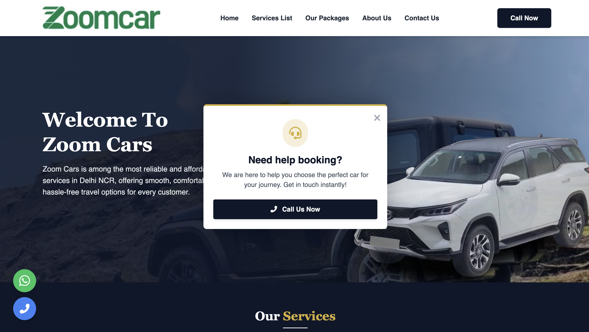
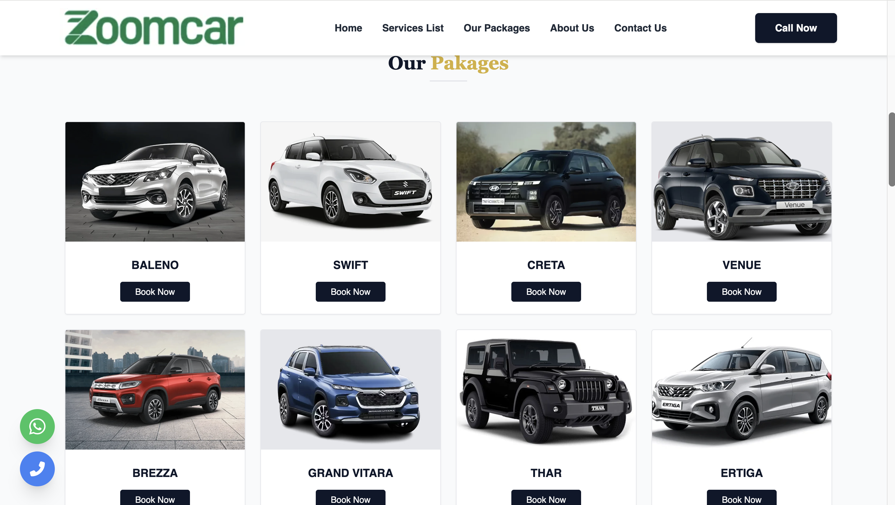
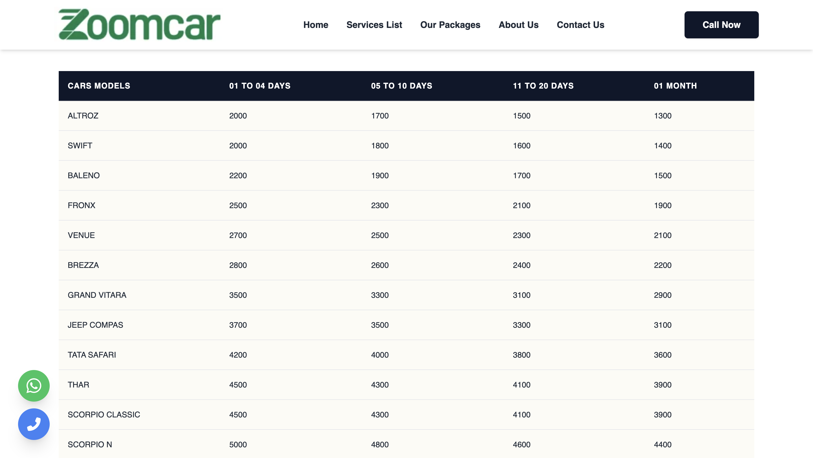
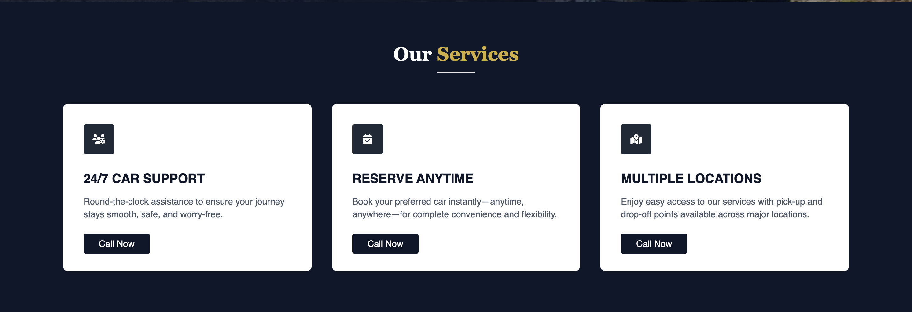
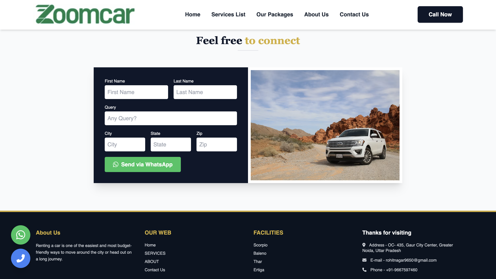

# 🚗 Rental Cars Website

## 📖 Overview

A modern and responsive car rental website developed for a client. The website allows users to browse vehicles, view pricing, explore rental packages, and submit booking inquiries.

> **Note:** This repository is a portfolio case study. The original source code is private because it belongs to the client.

---

## 👨‍💻 My Role

- Designed and developed the website
- Built responsive user interfaces
- Implemented booking inquiry functionality
- Optimized performance
- Applied SEO best practices
- Deployed the website

---

## 🛠 Technologies

- PHP
- MySQL
- HTML5
- CSS3
- JavaScript
- Bootstrap

---

## ✨ Features

- Responsive design
- Car rental packages
- Pricing section
- Contact & inquiry form
- SEO-friendly pages

---

## 📸 Website Screenshots

## 📸 Website Screenshots

### 🏠 Homepage

---

### 📦 Packages Page

---

### 💰 Pricing Page

---

### 🛠 Services Page

---

### 📝 Booking / Query Form

---

## 🌐 Live Website

https://zoomcars.in
